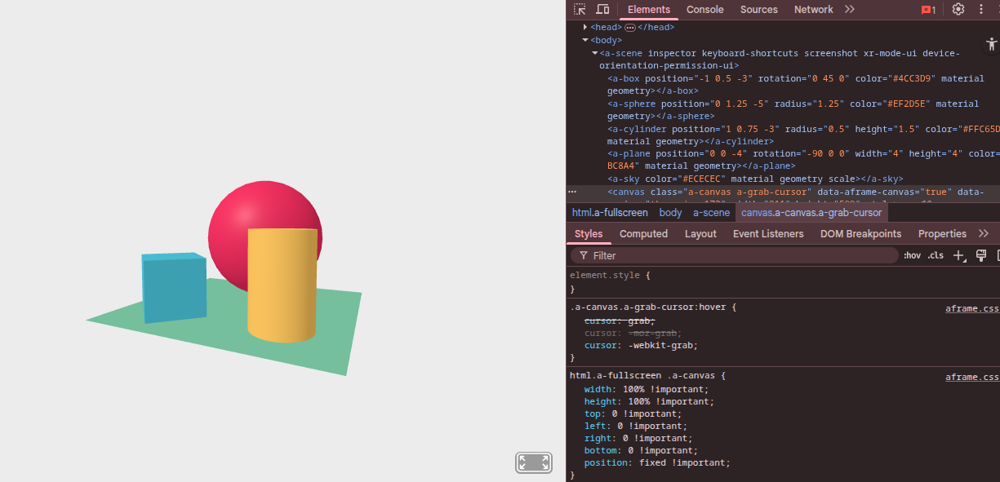
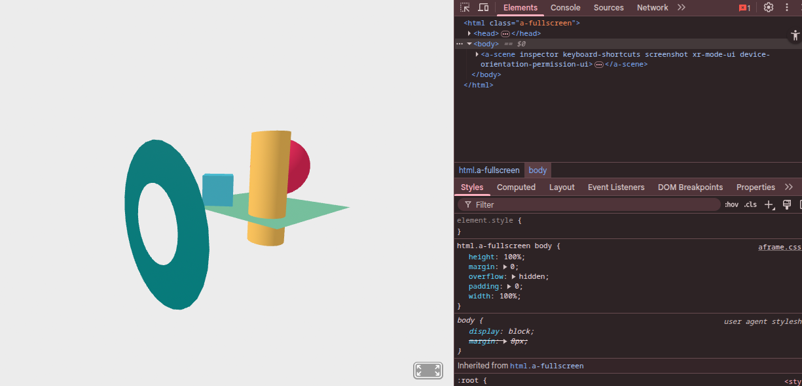

# Entry 4
##### 3/9/25

## Content
I chose **A-frame** as my tool. I tinkered with the starting code while reading the documentation and then inspected it. First, I reviewed the code and the 3D results, trying to understand how it works. Before I tinkered with my tool, I went through the documentation. A-frame has basic primitive and HTML attributes. I played around with the code; I changed the primitives and their properties, like size and radius. Then I decided to add a ring in front of the starter code. This is the right tool because of the 3D framework and how simple it is to create <u>3D web scenes with only HTML</u>.

## Source
I'm using [A-frame](https://aframe.io/docs/1.7.0/introduction/html-and-primitives.html) docs recent version to learn, and I am also using a **YouTube playlist** titled [Learn A-frame WebVR](https://www.youtube.com/watch?v=liOLtcPmMa0&list=PL8MkBHej75fJD-HveDzm4xKrciC5VfYuV&index=4). I tend to use the documentation more than the YouTube videos because on the YouTube playlist, the demonstration isn't on the latest version. So I try to remind myself that every time I code. I use YouTube videos when I don't understand something in the documentation, and I learn more effectively by watching them, so I do that too.

## Skill
One skill that I learned during this experience is **LOYO, how to learn on my own**! I learned that I can not only use this skill when learning how to make my tool, but also in the outside world. So if I want to learn on my own, I know I can always use videos from YouTube. I can search Google for the topic and find specific topics and definitions on what I want to learn. Knowing how to YOLO also fosters **strong independence**, because if no one is available to help me, I know how to learn or find answers on my own!

[Previous](entry03.md) | [Next](entry05.md)

[Home](../README.md)
