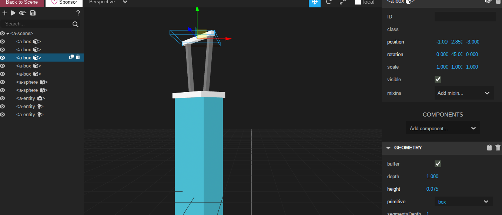

# Entry 5
##### 4/20/26

## Content
For my A-frame tool, I learned how to use 3d components and their properties. I tinkered with it first, trying out the example code in the A-Frame documentation. I learned how to use `<a-entity>` and the basic components to construct a prototype on how I would imagine my future invention topic for dental health. Then, after learning, I soon started to use my own code by using a box for the base of the prototype and cylinders for buttons on the prototype after getting used to it. As a result, I made 2 tinkering files: one to try out more code examples from the A-Frame documentation. The main one, which was the first one, was using components as a prototype to make future technology in my topic of dental health, an electric flosser, but instead of the water ones, it's a traditional dental floss. I really enjoyed using A-frame and the inspect tool was really the biggest help!

## Skills
I learned a different skill which helped me in this class and in other classes. So when I'm learning I usually want to learn it first before trying it out so it comes out good or perfect but. During the end of the learning log I decided to try something different since I was running out of time. It was learning and doing the work so rather than. Going by step learning, and then learning second that HELPED SO MUCH it helped me learn it effectively. Since I got to idenitfy what I did wrong and since I learn from my mistakes by not doing it again. Im doing this for all my classes now hehe!

[Previous](entry04.md) | [Next](entry06.md)

[Home](../README.md)
