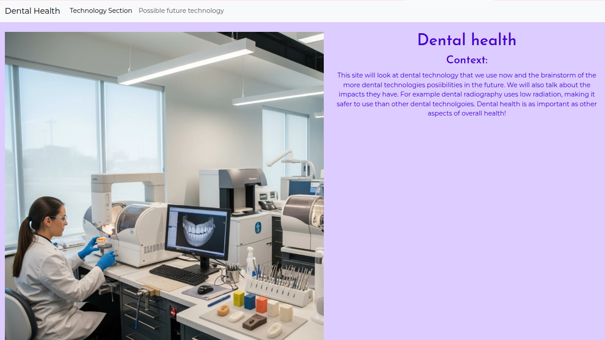
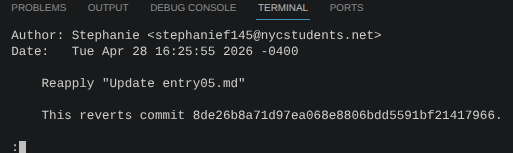

# Entry 6
##### 5/4/26

## Content
I made my mvp by adding colors for example the background. When I think about dental health I think about colors like blue or purple. So I just when with purple for the whole color scene. I used style css in order to specifically choose what I wanted to be colored. Then I added google fonts I used the href added it on the html then went back and chose with h# or p I wanted to give a font too. After all the designing I went on to alligning and positioning stuff. I was gonna use **.container** for my cards but they would move to the left so I sticked with the decision of only using **.container-fluid.**

  

   ### Challenges and take aways
   **Alignment and posittioning** *was the biggest challenge* while I was doing it I accidentaly press the refresh button and forgot to git add and git commit and push. So this resulted bad. I was trying to find different ways on how to position and then the positioning went bad and then I refreshed. So then I tried to revert. It went wrong again I reverted again but half my structure was gone so I had to reset half of it going from the apps to below. It didn't led me revert back till a few 40 mins cause I forgot to commit. So I had to restart but thats okay I got it done!
   
   

## Sources
-**SEP notes** for the coloring and fonts. Since I don't memorize everything so for the google fonts in my notes I checked around unit 1-2 from the code academy that all you needed to do was. Go to google fonts, pick a font. Get the code href html. Then check the css name. The href html you add it before the style and body. Then the css in the style.css and choose what you want to apply the font for.
-I then used **w3schools** for color choosing a shade of purple I wanted and to get the code you needed to add for the background color and letter's

## EDP
I am at **creating a prototype** I just created my index.html for the solution of informing people about dental health! Most importantly it's innovations and possible future innovations with some 3d help thanks to A-frame. I used what I learned from SEP and my LOYO with a-frame to create my prototype the index.html and the beyond mvp feautures!

## Skills
*Skill's I learned for this class is* to **always git commit and git add then push!** If you accidentaly press refresh without doing anything! You can't really go back. Well for me I do many at once but this time ill commit by chunks ill use the workflow so I make sure nothing like that ever happens to when using cs50.dev Other skills where **discipline**. When I reverted it to back to halfway I was about to give up but then I realized that yes it was a mistake, yes I have to start over. I was kind of bummed out but I soon recovered quickly and told myself to do it , I don't wanna fall behind or give up just because of a tiny mistake. So I continued on yay!

[Previous](entry05.md) | [Next](entry07.md)

[Home](../README.md)
