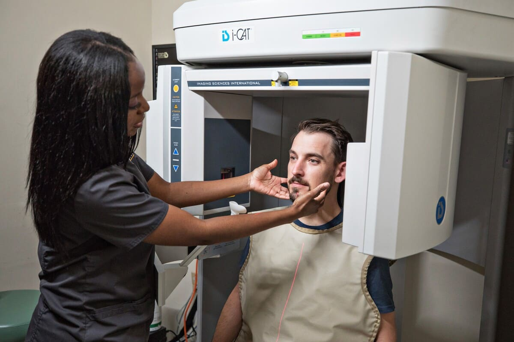

# Content
Topic: **Dental health**

## Overview/Introduction/Context
* This site will look at dental technology that's used now and the possibilities of more in the future
* Dental radiography uses low radiation, making it safer to use than other technologies.
* Why dental health is important as other aspects of overall health.

Categories
* **Categories**
* **Least complex**
* 1st Google search: Dental health apps
* 1st website looked at: https://www.brushdj.com/
  * 1st app review was **Brush DJ**
      * Free app
      * Easy to start
      * Play two minutes of your music on the iTunes app
      * Track time on brushing
      * It's a more fun way of brushing your teeth
      * Instead of counting in your head, you get to use the app, which tells you the right time to brush
  * 2nd app: **Dental care app**
      * You can brush your teeth with a special guide with visuals
      * You can check your brushing statistics
      * Use on phone
  * 3rd app: **Text 2 floss**
  * Reviewed website link with their information too: https://texttofloss.com/
      * Great for kids and teenagers to help them develop their hygiene routines
      * Sends you text messages to encourage your healthy oral habits
      * Track and view your oral health progress
      * GPS to find a dental clinic close by
      * Oral health management
      * US health educator
      * Not only helps you keep a routine, but educates you as well
      *   * Dentrix
      * Website viewed: https://www.henryscheinone.com/products/dentrix-ascend/?utm_source=capterra&utm_medium=ppc&utm_campaign=dtxa-promo-capterra&tname=2025-08-digital-ad-dtxa-promo-capterra&gdmcid=f6992493-fa0a-43d5-8dbc-5ad0acf7c740
      * a comprehensive dental practice management software designed to streamline administrative and clinical workflows in a dental office.
      * Helps with organization
*  **Mildly complex**
  * Intraoral scanners
      *  No radiation
      * These handheld wands use optical or laser technology to capture high-resolution, three-dimensional digital impressions of a patient's mouth.
  * Intraoral Cameras
      * High-tech cameras that provide real-time images of a patient's mouth, which can help with patient education and understanding treatment plans.
  * T scan
    
      * Uses digital sensors
      * advanced software
      * measures the force and timing of your bite
      * You bite down on a thin sensor.
*  **Most complex**
  * Dental radiograph
      * Website looked at: https://my.clevelandclinic.org/health/diagnostics/11199-dental-x-rays?utm_source=
      * You bite a chewing tab that can also be called a sensor holder to keep the digital sensor ready to use
      * They use the X-ray sensor and step back and press a button to activate the X-ray machine that scans your teeth
      * This X-ray shows images of your teeth and bone
      * They use this to check for cavities, bone loss, and other issues
      * Low radiation
## Part B: possible future technology
* Cleaning the scanner for teeth
  * Before the dentist cleans the patient's teeth, they use this scanner, which has this type of light that detects the most parts that need cleaning by showing colors, detecting how much bacteria it has
  * 4 types of colors detect how much bacteria there is: light, normal, mild really mild.
  * It also has a scale to detect if this person's teeth health is good
* A medicine for wisdom teeth after procedures to remove them
  * So there is a medicine so your wisdom teeth don't swell a lot
  * Only dentists can apply it after the procedure
  * This can help with people who always go through a lot of pain after getting their wisdom teeth removed
* A tiny machine that helps you floss much faster
  * It's rechargeable
  * It uses AI
  * connected with an app on your phone
  * It has this tiny screen that tells you how many times you have flossed
  * Send your phone notifications to floss if you have forgotten to
  * Long-lasting battery life
  * You place the tiny machine next to the tooth gap you wanna gloss. You have to place it well, and it turns green, and it starts flossing and doing the movement to floss that gap of your teeth, so all you have to do is hold it.
  * You have to change the string after using it for hygiene purposes.
