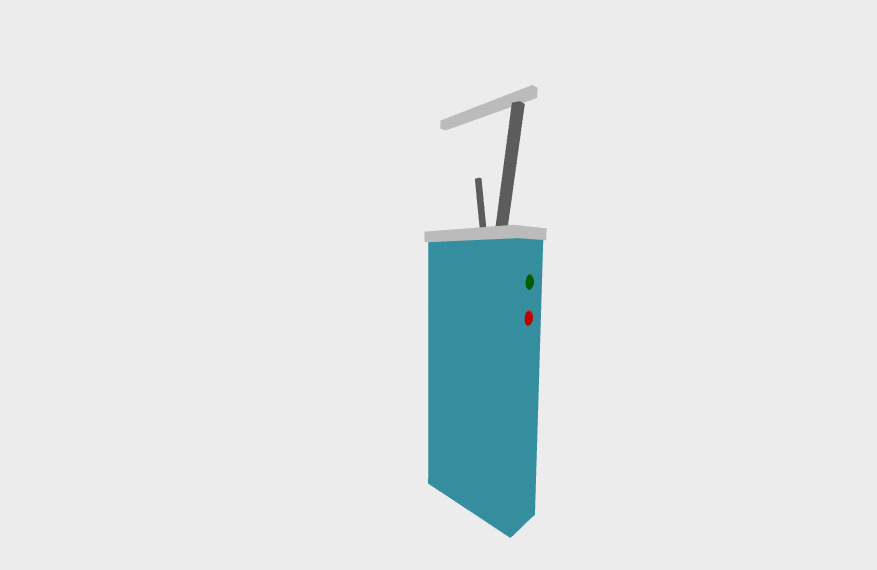

# Tool Learning Log

## Tool: **A-frame**

---
3/22/2026 note
 I've been using loose-leaf to take notes on the topics I'm learning from A-frame, and then I will be typing the notes in here!
 I feel like ive mostly took notes because i dont like doing something before learning it, so I think I will be working on practicing it more, since thats also learning too, so more tinkering rather than notes.
### 3/16/26:
* What is A-Frame: It's a Web framework for virtual reality experiences. A-frame is based on HTML.
* Just drop in a `<script>` tag and a `<a-scene>`. So A-frame handles 3d boiler plate, the VR setup, and default controls.
* A frame has a handy built in 3d inspector so when you open a-frame scene and hit ctrl+i or ctrl+option+i
* They have core components like
    * Geometries
    * Materials
    * Lights
    * animations
    * models
    * raycasters
    * shadows
    * positonal
    * audio
    * text
* They have components like furthermore
    * environment
    * state
    * particle systems
    * physics
    * multiuser
    * oceans
    * teleportation
    * augmented reality

### 3/17/2026
* Installation + Testing: Go to A-Frame documentation and copy the script, paste it inside the head tag
* When you add the a-scene element, it enters the VR mode button, telling you it has been installed
* Basic Primitives + HTML attributes are in the documentation
* Each primitive has its own specific attributes + properties


### 3/18/26:
What I learned while reading through the **entity component system** doc on A-Frame
* ECS architecture is a common desirable pattern in 3D and game development that is led by the composition over inheritance and hierarchy principle.
* An entity is basically a mix of components that assemble to create an entity, for example, from the documentation says Light **Bulb = Position + Light + Geometry + Material + Shadow**
* Systems are represented by <a-scene>‘s HTML attributes.
* To create an entity, we can use this format
* format: <a-entity ${componentName}="${propertyName1}: ${propertyValue1}; ${propertyName2}: ${propertyValue2}">
What I learned while reading through the **writing a component** doc on A-Frame
* Entities are like empty containers; they only have stuff added when components have been attached
* It's mostly good in use for complex objects with the formation of components by itself

### 3/19/26:
 Visual Inspector & Dev Tools
- ctrl + alt + i --> to inspect
- The inspector can be used to select, search, delete, clone, and add entities or export HTML.
- The viewport shows inspectors pov, so we can rotate, pan, or zoom the viewport to change the view of the scene, so you can transform entities, and it is better to use than switching back to code
- The viewport tools allow you to rotate, pan, zoom, select, and transform those entities using 3d handles
- There's a spectator mode for the third-person camera
- This is mostly used for testing, and better
- You can record

### 3/20/26:
Best Practices from A-frame
* Examples of what not to do
``` html
Do not do this:

<a-scene>
  <a-box></a-box>
  <!-- ... -->
</a-scene>

<script>
  // My JavaScript code here!
  // ... NO!
</script>
```
* what to do
``` html
<script>
  AFRAME.registerComponent('code-that-does-this', {
    init: function () {
      // Code here.
      console.log(this.el);
    }
  });

  AFRAME.registerComponent('code-to-attach-to-box', {
    init: function () {
      // Code here.
      console.log(this.el);
    }
  });
</script>

<a-scene code-that-does-this>
  <a-box code-to-attach-to-box></a-box>
  <!-- ... -->
</a-scene>
```
* Use VR design principles
* reduce unnecessary object creation
### 3/21/26:
Writing a component doc and takeaways
- Components can be reusable
- AFRAME.registerComponent() is used to register components
- Reusing components can help prevent performance issues
* Planning on what I want to use A-frame
  - I want to use it, so the future innovation I think may exist in the future is the electric floss so then
  - I would use components like cube and sphere mostly
  - I'd use the entity component system I learned on 3/18/26

### 3/23/26
**Introduction**
* Developed from plain html
- withour having to install
* A-FRAME is a web frame work for building virtual reality (VR) experiences
* the core is a poweful entity component framework that provides a declarative extensible and composable structure to three.js
* based on html
Drop in a `<script>` tag and `<a-scene>`. It will handle 3D boilet plate, VR set up and default controls
Powerful three.js framework, provides a declarative composable , reusable tntity component structure
- giving developers acccess to have unlimited access to Javascript, DOM, APIS , three js, webVR , Web GL
* You can build VR for Vive, Rift, Meta quest, windows mixed reality, and apple vission pro but im going to be using the standard desktop + smartphones
* 3D inspector Aframe scene with `<ctrl>` + alt + i or `<ctrl>` + option + i
so you can fly around to peek under the hood
and lastly for **components** can be checked in the documentation
**Installation**
- Play with the browser
- Local development
 Develop projects using a local server so that files are properly served
- Options like
  - terminal in the same directory as your html file
  - Python 3- m (check in docs)
- Open the project in the browser using the local url and port
In order to have it ina  html file drop in a `<script>` tag to the CDN build


### 3/24/26
### **VR Headsets & WebXR Browsers**
- A frame supports alot of platform
### **HTML & Primitives**
- A-frame uses HTML and DOM custom elements
- No build tools needed so you just write html and open it (for example using http-server)
- Uses and works JS frameworks
- Once you understand general strcuture of syntax html (tags + attribute)
**Primitives**
- Elements ex:`<a-box>` or `<a-sky>`
- They wrap entity component systems with defaults
- Theres already built in primitives to use
**extra!!**
- Primitives are like `<a-entity>`
  - but with a name like box
  - alot of components
  - the attributes have component property and mappings
  - Primitives are like entities so you can position, scale add those components
  - You can register custom primitives (check more in docs if needed)
  - Custom primitves can be reusable with stuff already built inside
### **Entity-Component-System**
-  A frame uses ECS for VR with components
**Entities**
- similar to container div
- only works when components are attached
- `<a-entity>`
**Components**
- Reusable modules that you can add how it looks, behavior or function
- Attached like html attributes
- Uses `AFRAME.registerComponent()`
**Systems**
- uses CDN
- provide global scope management and services for class of components
### 3/25/26
### **JavaScript, Events, DOM APIs**
- In order to control everything use Java script and DOM APis since A-frame scenes cant do much bc its just html
- Always use logic inside A-frame components so now just raw `<script>` tags after `</a-scene>`
- Use DOM selectors like `.querySelectorr()` and `.querySelectorAll()` for tag, id , class , components
- `.getAttribute()` is different it returns values rather than strings will return internal data object of the component dont modify directly
- You can edit modify entities and create add remove
- .setAttribute() to update property of component
### **Developing with three.js**
- WORKING WITH .objects3D 1. is an abstarct on top three js 2. it also has a refrence to `<a-scene>` 3. with a component we can access it var scene through this entity .object 3d
- ACCESSING components add the mesh and light below the enititys root THREE.Grouo so 1.Mesh 2.Light 3.Etc we can also access itt though the entitys .getObject3D(name)
- .object3DMap : compoents add tje mesj amd ;ight under entitys root mesh and light stores as different types of three.js objects in eneitys
- setObject3D: when settings that on a entity it adds its entity group making it a new Object3D part of three.js scene. We set is by its entity .setObject3D the name denotes the Object3D's purpose
- .getWorldPosition to get the world position and rotation od a 3dObject


### 3/26/26
### **Writing a Component**
-AFRAME.registerComponent(): components are regisytered with that. We put the name of the component which will be used as the HTML attributes name in the components representation in the DOM. Then pass component definition. Within it we can define lifecycle handler methods like .init() which is available when the component is plugged into its entity
-Schema defines the properties of its component
.init() is the most basic component that will log a simple message once the components entity is attached using the .init() handler.
-to handle property updates we can use .update()
-the tick handler adds a continously running behavior that runs on every frame of the render loop to the scene that also demonstarte relationships between entities
### **Interactions & Controllers**
5 key mainpoints for both topics i studied today since I didnt have enough time today
- events: 2D web input and interactions are handled through browser events, A frame also relies on events they are synthethic custom events that can be used to any component describing any event
- Cursor: handling events and interactions are the as gazed interactions with the cursor component, it created a synthethic click event on gaze with a raycaster ex like: create a synthethic click event
- Event-set: it makes the basic event handledrs declarative, which can also target other entities
using _targer: ${selector.} works with other components
- Tracked controls: and collison detection components into interactive gestures and communitates for mainly target entities in order for them to respond
so gestures like : hover, grab , stretch, drag-drop
- Laser controls: gives laser interactions for controllers it can be configured by adjusting the length of the raycaster
*note: when you have time work on studying the rest for now will do main points so i used ctrl-f after reading through everything just checking the important ones rather than extraaa*
### 3/27/26
*I feel like I barely wrote notes because of the SHABR worked on and the classwork bc of the trip sorry me tired*
**3D Models**
- use 8*gtif** is posibe to gain adoption as the standard transmitting 3D models over the web
- if you dont see textrues use **OBJ**  -- go back to developing 3JS or writing a component if u dont remember
- use animation-mixer component to play a models built in animations, **it can be merged into a frames core in the future**

**note: for the new learning log i wanted to learn everything by order rather than just going for the "important" to get a better understanding**

### 3/30/26
On my a-frame tinkering I tried to prototype the flosser future innovation I have on the freedom project I used the box components for the build the floss etc and then the spheres attaching them to the box as buttons



Though i couldnt get the other gray part attached to the flosser so its okay ill fix that problem tomorrow

### 3/6/26

### 3/8/26


### 3/15/26
I decided to make another tinkering html for my tool so I can test out the physic's components and other examples on A-frame and the 1st one has the prototype. I fixed the gray part which is a box component but its supposed to be one of he parts that connect the string flosser and so. I went back to my notes and was wondering how can I get the exact coordinates to bring theese together and fix it so I don't have to keep assuming or going back to the guide telling me what highers and lower numbers lead to what. So then I used the inspector when I used https-server going to the tinkering htmls link and used ctrl+i or ctrl+option+i and I got to move the part to where I wanted to so now I have a better idea in how to use inspector alot and actually look through my notes more rather than the documentation.

### 3/16/26
Here I was exploring how to use more simple Javascript codes to edit my components basically register a component like a-box to a AFRAME.registerComponent what I did wrong at first why it didnt work the whole time when registering a component is that
* You need to add the AFRAME.registerComponent to A SCRIPT TAG not a HTML --> I didnt really know where to place it so I added it to the html so solving this is good progress

### 3/17/26
After finally refreshing my brain with going back to using compoents and using AFRAME.registerComponent I will apply this to my prototype

Photo goes here :


<!--
* Links you used today (websites, videos, etc.)
* Things you tried, progress you made, etc
* Challenges, a-ha moments, etc
* Questions you still have
* What you're going to try next
-->
